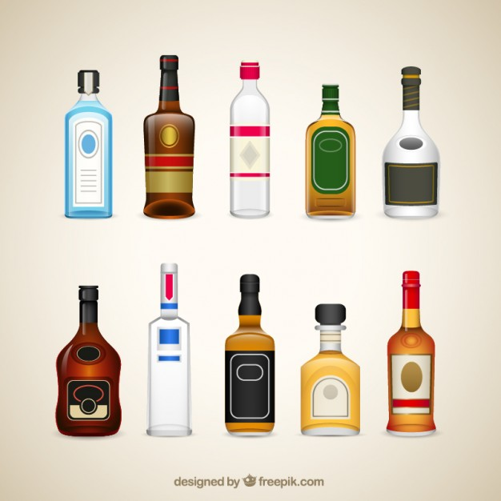

```{r setup, echo=FALSE, results='hide', message=FALSE, warning=FALSE}
# Če želimo nastaviti pisave v PDF-ju, odkomentiramo
# in sledimo navodilom v programu.
#source("fontconfig.r", encoding="UTF-8")

# Uvoz vseh potrebnih knjižnic
source("lib/libraries.r", encoding="UTF-8")
```

```{r rstudio, echo=FALSE, results='asis'}
# Izris povezave do RStudia na Binderju
source("lib/rstudio.r", encoding="UTF-8")
```

# Izbira teme

Za temo sem izbrala alkoholna industrija. 
V projektu bom prikazala katere drzave proizvedejo/uvezijo/izvozijo največ alkohola. Ta tabela prikazuje številke za kolicine od leto 2008-2018 in je razpredelena po vrsta alkohola (tj. pivo, gin, vodka, rum, whisky). Potem pa sem ogledala tudi podatke o količina (ispiena) alkohola za leto 2010. Torej bom ugotovila v katera država se največ oz. najmanj pije alkohol. Ta analiza bo vsebovala podatke po spolu, starost in frekfenca konzumacije. Se pa v katera drzava najvec pijejo mladi ljudi. Nasljedne podakte so povezane z cene alkohola. Torej kako se cene spreminjajo od 2008-2010 v države in kaj to pomeni za uživanje alkohola (ali dražje cene pomenijo manj uživanje alkohola ali ne). Tukaj bom vkljucila se GDP per kapita, torej kaksen je zivotni standard za tistih drzavah. Še ena tabela bom uvozila iz Wikipedije ki vsebuje države in stevilke - liter alkohola per capita. 



***

# Obdelava, uvoz in čiščenje podatkov

```{r uvoz, echo=FALSE, message=FALSE}
source("uvoz/uvoz.r", encoding="UTF-8")
```

Uvozila sem podatke od kolicina alkohola per capita iz Wikipedija v HTML obliki. Vse ostale podatke (cene, frekfenca kolicina, production) sem dobila iz spletne strani Eurostat v obliki CSV. 

Podatke imamo v štirih razpredelnicah v obliki *tidy data*.

1. `kolicina_pc` - podatki o kolicina alkohola per capita za 2010 po države
  - `Countries` - spremenljivka: ime države (character),
  - `Total alcohol` - meritev: število ispien alkohol v liter (numeric),
  - `Beer(%)` - meritev: število kolicina piva v procentih  (numeric),
  - `Wine(%)` - meritev: število kolicina vina v procentih  (numeric),
  - `Spirits(%)` - meritev: število kolicina spirits v procentih  (numeric),
  - `Other(%)` - meritev: število kolicina ostale alkohole v procentih  (numeric).

2. `Kolicina` - podatki o kolicina alkohola za leto 2010 po države
  - `Country` - spremenljivka: ime države (character),
  - `Age` - spremenljivka: starost (character),
  - `Frequency` - spremenljivka: frekfenca na konzumacije alkohola (character),
  - `Sex` - spremenljivka: spol (character),
  - `65 years and older` - meritev: število konzumacija ljudi 65+ let,
  - `From 15 to 24 years` - meritev: število konzumacija ljudi 15-24 let,
  - `From 25 to 64 years` - meritev: število konzumacija ljudi 25-64 let.
  
3. `Cene` - podatki o cene alkohola po države
  - `Country` - spremenljivka: ime države (character),
  - `Year` - spremenljivka: leto  (numeric),
  - `Type` - alkohol (character),
  - `Value` - meritev: število sprememba cene alkohola (Price level indices (EU28=100)) (numeric).
  
3. `Production` - podatki o proizveden, uvozen, izvozen alkohol po države
  - `Country` - spremenljivka: ime države (character),
  - `Year` - spremenljivka: leto  (numeric),
  - `Type of alcohol` - vid alkohol (character),
  - `Exports` - meritev: število izvozen alkohol (numeric),
  - `Imports` - meritev: število uvozen alkohol (numeric),
  - `Production` - meritev: število proizveden alkohol (numeric).
  
  
#**Opomba**: da bi razpredelnica `obcine` res bila v obliki *tidy data*, bi morali odstraniti stolpec `gostota` (saj je izpeljan iz stolpcev `povrsina` in `prebivalci`), podatke o pokrajinah pa bi morali premakniti v drugo razpredelnico, saj nekatere občine pripadajo dvema pokrajinama. Podobno bi morali narediti tudi s stolpcem `odcepitev`.

***

# Analiza in vizualizacija podatkov

```{r vizualizacija, echo=FALSE, message=FALSE, warning=FALSE, results='hide'}
source("vizualizacija/vizualizacija.r", encoding="UTF-8")
```

Spodnji graf

```{r graf_cene, echo=FALSE, fig.align='center', fig.cap='Graf 1'}
graf_cene
```
Spodnji graf
```{r graf_proizvodnja, echo=FALSE, fig.align='center', fig.cap='Graf 2'}
graf_proizvodnja
```

Spodnji zemljevid

```{r zemljevid_kolicina_alkohola, echo=FALSE, fig.align='center', fig.cap='Zemljevid 1'}
zemljevid_kolicina_alkohola
```

```{r zemljevid_kolicina_alkohola_mlade, echo=FALSE, fig.align='center', fig.cap='Zemljevid 2'}
zemljevid_kolicina_alkohola_mlade
```
***

# Napredna analiza podatkov

```{r analiza, echo=FALSE, message=FALSE}
source("analiza/analiza.r", encoding="UTF-8")
```

Spodnji graf prikazuje povezavo med številom naselij in površino občine.

```{r graf, echo=FALSE, fig.align='center', fig.cap='Povezava med številom naselij in površino občine'}
ggplot(inner_join(obcine, data.frame(obcina=names(skupine),
                                     skupina=factor(skupine)), by="obcina")
, aes(x=povrsina, y=naselja, color=skupina, size=prebivalci/1000)) + geom_point() +
  ggtitle("Število naselij glede na površino občine") +
  xlab(expression("Površina (km"^2 * ")")) + ylab("Št. naselij") +
  guides(color=guide_legend(title="Skupina"),
         size=guide_legend(title="Prebivalci (* 1000)"))
```

***

```{r shiny, echo=FALSE}
shinyAppDir("shiny", options=list(width="100%", height=600))
```
