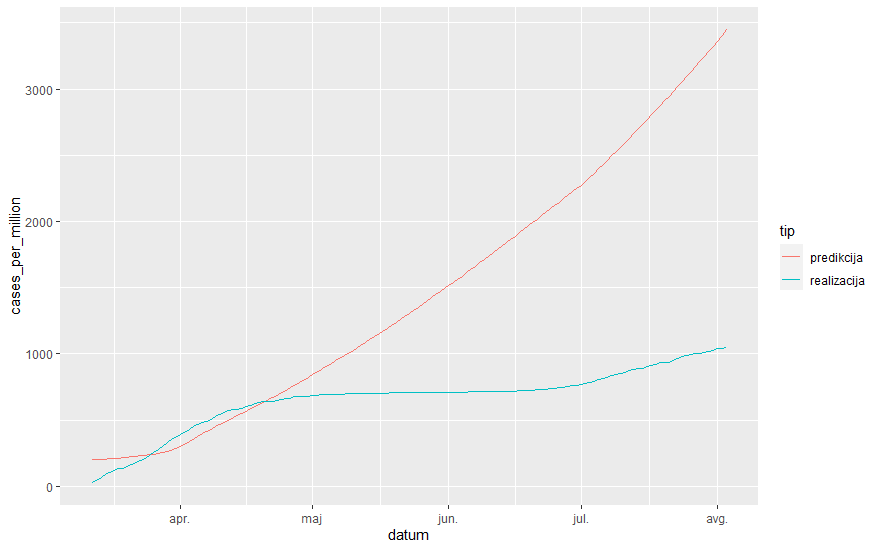

```{r setup, echo=FALSE, results='hide', message=FALSE, warning=FALSE}
source("lib/libraries.r", encoding="UTF-8")
```

```{r rstudio, echo=FALSE, results='asis'}
# Izris povezave do RStudia na Binderju
source("lib/rstudio.r", encoding="UTF-8")
```


V projektu sem analiziral epidemijo pri nas in po svetu. Našo stanje sem primerjal s svetovnim, primerjal pa sem tudi medcelinsko stanje.


***

# Obdelava, uvoz in čiščenje podatkov

```{r uvoz, echo=FALSE, message=FALSE}
source("uvoz/uvoz.r", encoding="UTF-8")
```
Uvozil sem podatke o korona virusu v excel obliki iz uradne strani NIJZ in podatke o svetovnem stanju v obliki csv iz spletne strani covid.ourworldindata. Iz wikipedije sem uvozil še podatke o prebivalcih celine.

1. Tabela 1: COVID-19 v Sloveniji 
  - `datum` - spremenljivka: datum,
  - `rutinsko.dnevno` - meritev: število rutinskih testiranj dnevno,
  - `raziskava.dnevno` - meritev: število  testiranjv sklopu raziskave dnevno,
  - `moski` - spremenljivka: število pozitivnih testov moških,
  - `zenske` - spremenljivka: število pozitivnih testov žensk,
  - `delovni.dan` - logični operator: nakazuje ali je delovni dan ali vikend.
  
2. Tabela 2: COVID-19 po Svetu 
  - `date` - spremenljivka: datum,
  - `location` - spremenljivka: država,
  - `new_tests` - meritev: število novih dnevnih testov,
  - `continent` - spremenljivka: celina,
  - `iso_code` -spremenljivka: krajšava države,
  - `total cases` - meritev: število vseh potrjenih primerov,
  - `total_deaths` - meritev: število vseh smrti,
  - `total_deaths_per_million` - meritev: število smtrni na milijon prebivalcev,
  - `total_cases_per_million` - meritev: število vseh primerov na milijon prebivalcev,
  - `life_expectancy` - spremenljivka: pričakovana življenska doba,
  - `extreme_poverty` - spremenljivka: odstotek izjemno revnega prebivalstva.
3. Tabela 3: Populacija celin
  - `population_continent` -spremenljivka: prebivalci celine,
  - `continent` - spremenljivka: celina.

***

# Analiza in vizualizacija podatkov

```{r vizualizacija, echo=FALSE, message=FALSE, warning=FALSE, results='hide'}
source("vizualizacija/vizualizacija.r", encoding="UTF-8")
```

Spodnji graf prikazuje dnevna testiranja v Sloveniji.

```{r dnevno_stevilo_testiranj_linija, echo=FALSE, message=FALSE, fig.align='center', warning = FALSE}
print(dnevno_stevilo_testiranj_linija)
```
Iz grafa se razbere, da se je testiranje do sredine aprila povečevalo, nato pa je začelo padati, junija pa se je zopet povečalo.


Spodnji graf prikazuje skupna testiranja v Sloveniji. 

```{r stevilo_testiranj, echo=FALSE, message=FALSE, fig.align='center', warning = FALSE}
print(stevilo_testiranj)
```


Spodnji graf primerja testiranje čez teden proti testiranju čez vikend

```{r dnevno_stevilo_testiranj_delovni_dan, echo=FALSE, fig.align='center', message=FALSE, warning=FALSE}
print(dnevno_stevilo_testiranj_delovni_dan)
```

Iz grafa je jasno razvidno, da število testiranj čez vikend pade.


Spodnji graf primerja število pozitivnih testov pri ženskah in moških 

```{r dnevno_stevilo_okuzenih_moskivszenske, echo=FALSE, message=FALSE, fig.align='center', warning = FALSE}
print(dnevno_stevilo_okuzenih_moskivszenske)
```
Iz grafa se razbere, da občutne razlike med spoloma ni, saj se približek za število okuženih praktično prekriva.


Spodnji graf prikazuje odstotek pozitivnih testov v Sloveniji.

```{r procent_okuzenih_dnevno, echo=FALSE, message=FALSE, fig.align='center', warning = FALSE}
print(procent_okuzenih_dnevno)
```

Podobno, kot pri testiranju je tudi tu razviden drugi val.


Spodnji histogram kaže, kako pogosto smo v Sloveniji imeli določeno število dnevno pozitivnih testov.

```{r frekvenca_stevila_okuzb, echo=FALSE, message=FALSE, fig.align='center', warning = FALSE}
print(frekvenca_stevila_okuzb)
```

Na histogramu se vidi, da med pogostostjo števila okužb in številom pozitivnih testov velja obratno sorazmerje.


Spodnji graf prikazuje število pozitivnih testov na celem svetu na milijon prebivalcev

```{r stevilo_primerov_na_svetu_na_million, echo=FALSE, message=FALSE, fig.align='center', warning = FALSE}
print(stevilo_primerov_na_svetu_na_million)
```

Iz grafa se razbere, da je prekuženost marca poskočila od aprila naprej pa narašča linearno.


Spodnji graf primerja število okuženih na milijon v ZDA proti celotni Evropi.

```{r USAvsEU, echo=FALSE, message=FALSE, fig.align='center', warning = FALSE}
print(USAvsEU)
```

Iz grafa razberemo, da prekužebost v ZDA od aprila narašča veliko hitreje, kot v Evropi.


Zemljevid svetovne prekuženosti:
```{r Zemljevid_cases_per_million, echo=FALSE, message=FALSE, fig.align='center', warning = FALSE}
Zemljevid_cases_per_million
```

# Napredna analiza podatkov

```{r analiza, echo=FALSE, message=FALSE}
source("analiza/analiza.r", encoding="UTF-8")
```
S pomočjo grobe ocene aktivnih primerov pri konstantnem in nekonstantnem testiranju v Sloveniji.

```{r aktivne_okuzbe_realnevsCCA , echo=FALSE, message=FALSE, fig.align='center ', warning = FALSE}
print(aktivne_okuzbe_realnevsCCA)
```

Za oceno aktivnih okužb sem zopet predpostavil, da je človek zdrav po 14dneh. Ker sem iz grafa testiranja glede na delovni dan ugotovil, da je število dnevnih okužb povezana z dnevom v tednu, sem primerjal, kako bi izgledalo število aktivnih okuženih, če bi vsak dan naredili 1000 testov, kjer pa bi se procent okuženih ohranjal. Iz grafa vidimo, da se ocena aktivnih okužb razlikuje samo v prvem in zadnjem delu, kar je zanimivo, glede na to, da je število okuženih pri konstantne testiranju priblžno konstantno večje, kot pri nekonstantem (zaradi tega, ker v resnici opravimo približno 850 testov na dan). To je dobro razvidno na naslednjem grafu:

```{r stevilo_okuzenih_nekonstantnovskonstantno , echo=FALSE, message=FALSE, fig.align='center', warning = FALSE}
print(stevilo_okuzenih_nekonstantnovskonstantno)
```

Spodnji graf prikazuje število vseh pozitivnih testov na svetu proti grobi oceni aktivnih primerov.

```{r Vsi_okuzeni_proti_aktivni, echo=FALSE, message=FALSE, fig.align='center', warning = FALSE}
print(Vsi_okuzeni_proti_aktivni)
```

Vidimo, da število aktivnih primerov še vedno raste. (Tu, je treba izpostaviti, da podatkov za aktivne primere ni bilo, zato sem predpostavil, da je človek 14 dni po pozitivnem testu zdrav in tako dobil grobo oceno.)

Spodnji graf prikazuje primerjavo procenta umrlih glede na število ukužb, glede na pričakovansko življensko dobo, z barvami pa so označeni tudi kontitnenti.

```{r Death_rate_life_expectancy , echo=FALSE, message=FALSE, fig.align='center', warning = FALSE}
print(Death_rate_life_expectancy )
```
Na grafu so točke najbolj goste pri majhnem procentu pri visoki pričakovani življenski dobi, pri nižji pa vidimo nekoliko višjo variacijo, ki je verjetno posledica slabše zdravstvene oskrbe in nezaznavanja okužb, ki je posledica pomankanja testiranja.


Spodnji graf prikazuje primerjavo procenta umrlih, glede na odstotek revnega prebivalstva, z barvami pa so označeni tudi kontitnenti.

```{r Death_rate_poverty , echo=FALSE, message=FALSE, fig.align='center', warning = FALSE}
print(Death_rate_poverty)
```

Iz grafa se dobro vidi, da so evropske države, kjer je revščine malo zgoščene pri manjšemu procentu umrlih glede na število ukužb. Podobno kot prej, pri afriških državah zaznamo precej večjo variacijo.


Spodnji graf prikazuje skupno število testiranj glede na dan po kontinentih, ki so označeni z barvami. Debelina črt pa nakazuje število prebivalcev kontinenta.

```{r test_po_dnevih_svet, echo=FALSE, message=FALSE, fig.align='center', warning = FALSE}
print(test_po_dnevih_svet)
```

Iz grafa razberremo, da Severna Amerika in Evropa testirata občutno več, kot Azija. Razlika je še tako večja glede na števillo prebivalcev celine. Na grafu se vidi tudi to, da v Evropi testiranje čez vikend močno upade, zanimivo je, da je to pojav, ki se na drugih celinah ne dogaja.

Spodnji zemljevid prikazuje odstotek pozitivnih testov po drzavah.
Opomba: Iz zemljevida izbrisane države ne beležijo števila vseh testiranj.

```{r zemljevid_odstotka_pozitivnih_testov, echo=FALSE, message=FALSE, fig.align='center', warning = FALSE}
zemljevid_odstotka_pozitivnih_testov
```
Če zemljevid o okuženosti na milijon prebivalcev poda sliko, da je COVID-19 najbolj razširjen v Evropi in ZDA, nam ta zemljevid poda sliko, da so najvišji odstotki pozitivnih testov v srednji in južni Ameriki medtem, ko v Afriki večinoma sploh ne merijo števila testiranj. 

Spodnji zemljevid sem dobil tako, da sem za vsako državo posebaj izračunal trend novih okužb s pomočjo polinomske regresije tretje stopnje.
Nato sem izračunal koeficient tangente polinoma na zadnji dan za katerega so podatki, kar je bil v vseh primerih 5.8.2020. 

```{r zemljevid_trendov, echo=FALSE, message=FALSE, fig.align='center', warning = FALSE}
zemljevid_trendov
```
Iz slike razberermo, da v vseh svetlo in temno zelenih državah pričakujemo večanje števila novih okužb.

Nazadnje sem s pomočjo knjižnjic keras in tenserflow sestavil enostaven model za napoved števila okuženih v Sloveniji. 
Za treniranje modela sem uporabil sledeče podatke Evropskih držav.
  
  - `datum`
  - `skupni testi` ,
  - `Število prebivalcev države`
  - `medianska starost v državi`
  - `odstotek ljudi, ki so starejši od 65 let`
  - `odstotek ljudi, ki so starejši od 70 let`
  - `Življenska pričakovana doba` ,
  - `Death rate ljudi s pridruženimi kardiovaskularnimi boleznimi`
  - `odstotek diabetikov` 

Rezultat modela:



Model za Slovenijo ocenjuje več okuženih, kot smo jih v tem časovnem obdobju.
To je okvirno smiselna ocena, saj je prvi del epidemije Slovenija preživela z relativno majhnim številom okuženih v primerjavi z drugimi evropskimi državami.

